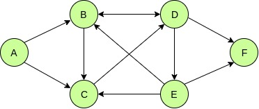
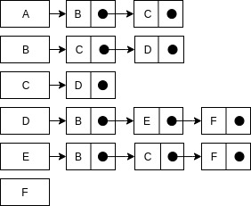
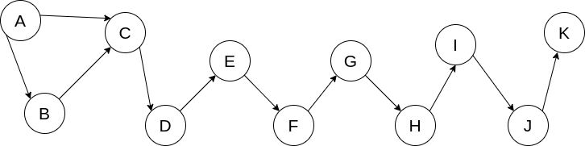

# Graph algorithms in Scala

Associated Udemy course: [Implementing graph algorithms using Scala](https://www.udemy.com/course/implementing-graph-algorithms-using-scala)

#### Table of content:

- [Graph representation](#repre)
- [Traversing graphs](#traversing)
  - [DFS](#dfs)
  - [BFS](#bfs)
- [Topological sorting](#topological)
  - [Kahn's algorithm](#kahn)
  - [DFS](#dfs-top)
- [Cycle detection](#cycle-detection)
  - [DFS](#dfs-cycles)
  - [Floyd's algorithm](#floyd-cycles)
- [Shortest path](#shortest-path)
  - [Dijkstra's algorithm](#dijkstra)


<a name="repre" />

### Graph representation

Graph can be represented by:
 1. Adjacency list
   - Fast access by indices
   - Easy to implement
   - Memory consumption (information about every existing or non-existing edge is stored)
   - Ideal for dense small graphs
 
 2. Adjacency matrix
   - Memory efficient
   - Scalable
   - Slower (for finding neighbour whole list of neighbours must be traversed)
   - Ideal for sparse large graphs

Example of directed graph represented by adjacency list:

|  |  |
| --- | --- |

Represented as `Map[N, List[N]]`, where `N` is generic data type.

Graph API:

```
def nodes: List[N]
def edges: List[(N, N)]
def addEdge(from: N, to: N): Graph[N]
def neighbours(node: N): List[N]
```
<a name="traversing" />

### Traversing graphs

<a name="dfs" />

#### Depth first search

Algorithm starts at the root node and explores as far as possible along each 
along each branch before backtracking. It can be implemented recursively or 
iteratively. DFS takes time `Θ(|N| + |E|)` where `N` is the number of nodes 
and `E` is the number of edges.

To avoid infinite run for cyclic graph we have to keep track of explored nodes.

Pseudocode of recursive approach: 

```
visited_nodes = {}

DFS(node):
    if visited_nodes not contain node:
        process node
        add node to visited_nodes
        foreach neighbour in node.neighbours
            DFS(neighbour)
```

Pseudocode of iterative approach:

```
DFS(node):
    visited_nodes = {}
    stack = {node}

    while stack not empty:
        n = stack.pop
        if visited_nodes not contain n:
            process n
            add n to visited_nodes
            push all n.neighbours to stack
```

<a name="bfs" />

#### Breadth first search

Algorithm starts at the root node and explores the neighbors and puts 
them into the queue. This process is repeated for every node in the 
queue. Graph is searched in waves. Nodes are processed in order of 
their distance from the root. BFS takes time `Θ(|N| + |E|)` where 
`N` is the number of nodes and E is the number of edges.

To avoid infinite run for cyclic graph we have to keep track of explored nodes.

Pseudocode:

```
BFS(node):
    visited_nodes = {}
    queue = {node}

    while queue not empty:
        n = queue.dequeue
        if visited_nodes not contain n:
            process n
            add n to visited_nodes
            enqueue all n.neighbours to queue
```

<a name="topological" />

### Topological sorting

- Linear ordering of nodes such that for every directed edge `uv` from 
node `u` to node `v`, `u` comes before `v` in the ordering.

- Works only for directed acyclic graphs (DAG).

- There are multiple topological sorting possible for a graph.

<a name="kahn" />

#### Kahn's algorithm

Algorithm works by finding nodes which have no incoming edges and removing all 
outgoing edges from these nodes.

Pseudocode:

```
kahn(graph):
    results = {}
    // set of nodes with no incoming edges
    startNodes = findStartNodes(graph)

    while startNodes not empty:
        n = removeFirst(startNodes)
        add n to results
        
        foreach neighbour of n:
            remove edge from n to neighbour
            if neighbour has no incoming edges:
                add neighbour to startNodes

    if graph has edges:
        error
    else
        return results
```

<a name="dfs-top" />

#### Depth first search

The algorithm loops through each node of the graph, in an arbitrary order, 
initiating a depth-first search that terminates when it hits any node 
that has already been visited since the beginning of the topological 
sort or the node has no outgoing edges.

Pseudocode:

```
DFSsort(graph):
    results = {}
    visited = {}

    foreach node in graph:
        if node not in visited:
            topologicalDFS(node, results, visited)

    return results

topologicalDFS(node, results, visited):
    add node to visited
    foreach neighbour of n:
        if neighbour not in visited:
            topologicalDFS(neighbour, results, visited)
    add node to results
```

<a name="cycle-detection" />

### Cycle detection

**Cycle** is a non-empty trail in which the first and last nodes are repeated.

Cycle detection can be used for detecting deadlocks in concurrent systems.

<a name="dfs-cycles" />

#### Depth first search

For DFS from every node keep track of visiting nodes in the stack. If the 
node is already present in the stack (back edge), the cycle was found.

Pseudocode:

```
visited = {}

containsCycle(node, ancestors = {}):
    if node is in ancestors:
        true
    if node is in visited:
        return false

    add node to visited
    cycle = false
    foreach neighbour of node:
        cycle = cyclic OR
            containsCycle(neighbour, ancestors + node)

    return cyclic
```

<a name="floyd-cycles" />

#### Floyd's algorithm

Also called tortoise and hare algorithm.

Algorithm uses two pointers, which move through nodes at different speed. Each 
step of the algorithm 'tortoise' pointer increases by one and 'hare' pointer 
increases by two and then compares the node sequence values at these two pointers.
If the 'hare' reaches the 'tortoise' during second traversal there is a cycle 
in the graph. If the 'hare' explores whole graph without meeting the 'tortoise'
there is no cycle.

Algorithm works only on simple structures. Doesn't work on graphs where multiple 
paths lead to the same node.

Example of the graph with false positive result:



Pseudocode:

```
move(stack):
    node = stack.pop
    if node != null
        push neighbours of node to stack
    return Astack

containsCycle(node):
    tortoise = move({node})
    hare = move(move({node}))

    while(peek(hare) != peek(tortoise) and notEmpty(hare)):
        tortoise = move(tortoise)
        hare = move(move(hare))
    
    return peek(hare) == peek(tortoise)
```

<a name="shortest-path" />

### Shortest path

Problem of finding a path between two nodes, source and destination, in a graph 
such that sum of the weights of its edges is minimized in the most optimal way.

Algorithms that solves the shortest path problem:

- Dijkstra's algorithm - solves single-source problem, non-negative edges
- Bellman-Ford algorithm - solves single-source problem, edges may be negative
- A* search algorithm - uses heuristics to find single pair shortest path
- Floyd-Warshall algorithm - solves all pairs shortest path

<a name="dijkstra" />

#### Dijkstra's algorithm

For a given source node, algorithm finds the shortest path between that node and 
every other nodes. It takes time O(|N|<sup>2</sup>). 

At the beginning source node has distance equal to 0 and all other nodes equal 
to infinity. Nodes are stored in priority queue which is sorted by distance. 
In each iteration is selected a top node from queue. For all its neighbors are 
calculated their tentative distances. The newly calculated tentative distance 
is compared to the current assigned value and the smaller one is selected. 
Neighbor is then added into priority queue. Whole path can be reconstructed 
from predecessors.

Pseudocode:

```
init(graph, source):
    dist = map()
    foreach node in graph
        dist(node) = inf
    dist(source) = 0
    parent = map()
    unprocessed = createSet(nodes)

shortestPaths(graph, source):
    init(graph, source)
    while(isNotEmpty(unprocessed)
        node = extractMin(unprocessed, dist)
        foreach neighbour, weight of node:
            if(dist(node) + weight < dist(neighbour)):
                dist(neighbour = weight + dist(node)
                parent(neighbour) = node
```

